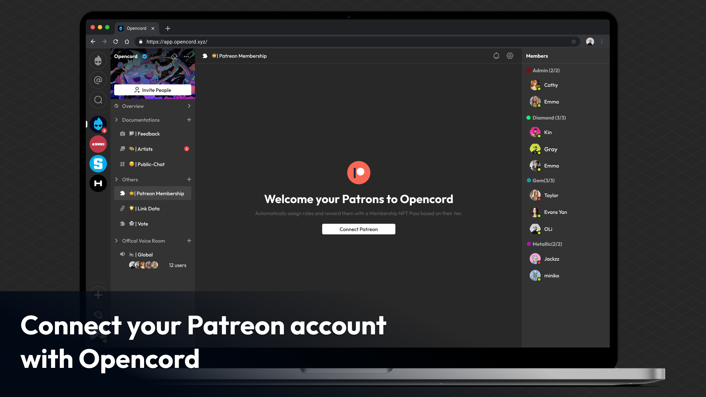
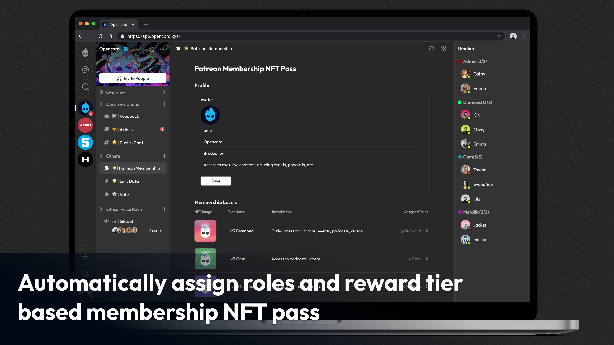
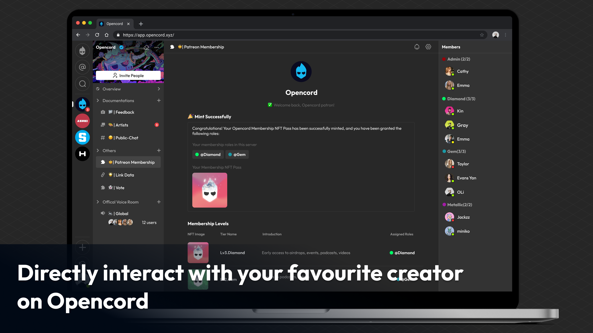

# Patreon Membership NFT Pass

> Automatically assign roles and reward your Patrons with a Membership NFT Pass based on their tier.

## 💡 Motivation

As more Web2 communities seek to integrate decentralized solutions into their communities, we recognize the need to provide a smooth and efficient Web3 onboarding process. 

## ✨ Introduction

To achieve this, we have developed a plugin based on the [Opencord SDK](https://developers.opencord.xyz/intro/overview) that seamlessly integrates Patreon memberships with Opencord's web3 native features such as token gating. 

[Opencord](https://www.opencord.xyz/) is a decentralized social platform designed for DAOs, which provides Web3-native features such as token gating to connect DAOs, DApps, and members of the Web3 community. The mission of Opencord is to make Web3 more accessible, intuitive, and enjoyable for everyone.

This plugin enables Patreon creators to automatically assign roles and award patrons with customized NFT passes that mirrors Patreon membership levels in their Opencord servers. By doing so, this plugin offers a simple and efficient solution for Patreon creators to manage their memberships and expand their audience into the world of Web3.

The plugin is built using layer 2 functions and will be incorporated into [Opencord SDK](https://developers.opencord.xyz/intro/overview). The NFT passes utilize leading layer 2 technology fully secured by Ethereum, offering lightning-fast trading speeds of up to 10k TPS, minimal gas fees, and the option to bridge to Ethereum in the future.

## 👀 Preview

## 🔧 How it's Made

To build this project, we used the [Opencord SDK](https://developers.opencord.xyz/intro/overview) and integrated it with the [Opencord](https://www.opencord.xyz/) platform. Specifically, we utilized the token gating component of the SDK, which currently supports several chains including ETH, BSC, Polygon, Harmony, Optimism, Fantom, Avalanche, Arbitrum, and Cronos.

We used OpenZeppelin as a template for the smart contract, which we deployed on the Ethereum blockchain. Additionally, we leveraged the Layer-2 scalability engine provided by Reddio to enable users to mint NFTs and trade them at lighting speed up to 10k TPS, and 0 gas fee.

For the frontend, we utilized the TypeScript language and the Next.js framework. We opted not to use any third-party UI libraries and instead built a lightweight component library and a state management from scratch.

On the backend, we utilized the Go language and the go-zero framework to develop the server-side logic.
